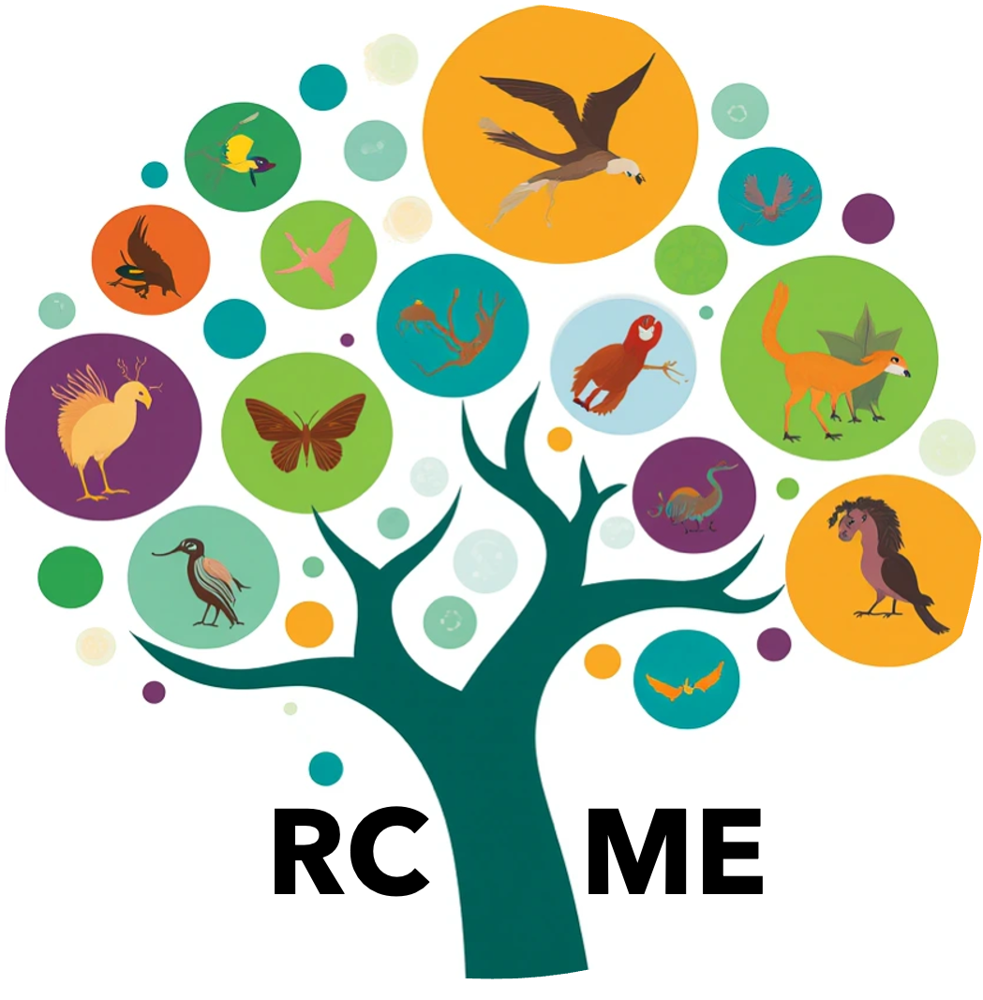

# Global and Local Entailment Learning for Natural World Imagery

<div align="center">


[]()
[](https://vishu26.github.io/RCME/index.html)
[]()
[]()

[Srikumar Sastry*](https://vishu26.github.io/),
[Aayush Dhakal](https://scholar.google.com/citations?user=KawjT_8AAAAJ&hl=en),
[Eric Xing](https://subash-khanal.github.io/),
[Subash Khanal](https://subash-khanal.github.io/),
[Nathan Jacobs](https://jacobsn.github.io/)
(*Corresponding Author)

<b>ICCV 2025</b>
</div>

📑 Citation

```bibtex
@inproceedings{sastry2025global,
    title={Global and Local Entailment Learning for Natural World Imagery},
    author={Sastry, Srikumar and Dhakal, Aayush and Xing, Eric and Khanal, Subash and Jacobs, Nathan},
    booktitle={International Conference on Computer Vision},
    year={2025},
    organization={IEEE/CVF}
}
```

## 🔍 Additional Links
Check out our lab website for other interesting works on geospatial understanding and mapping:
* Multi-Modal Vision Research Lab (MVRL) - [Link](https://mvrl.cse.wustl.edu/)
* Related Works from MVRL - [Link](https://mvrl.cse.wustl.edu/publications/)
