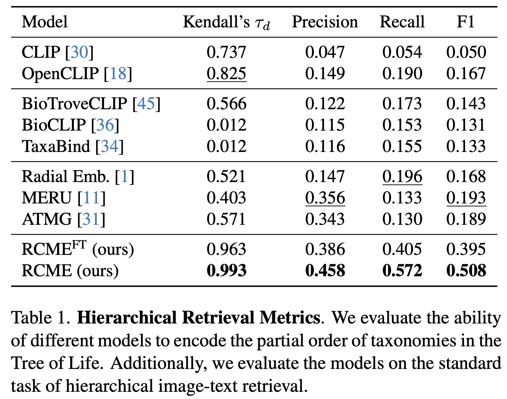
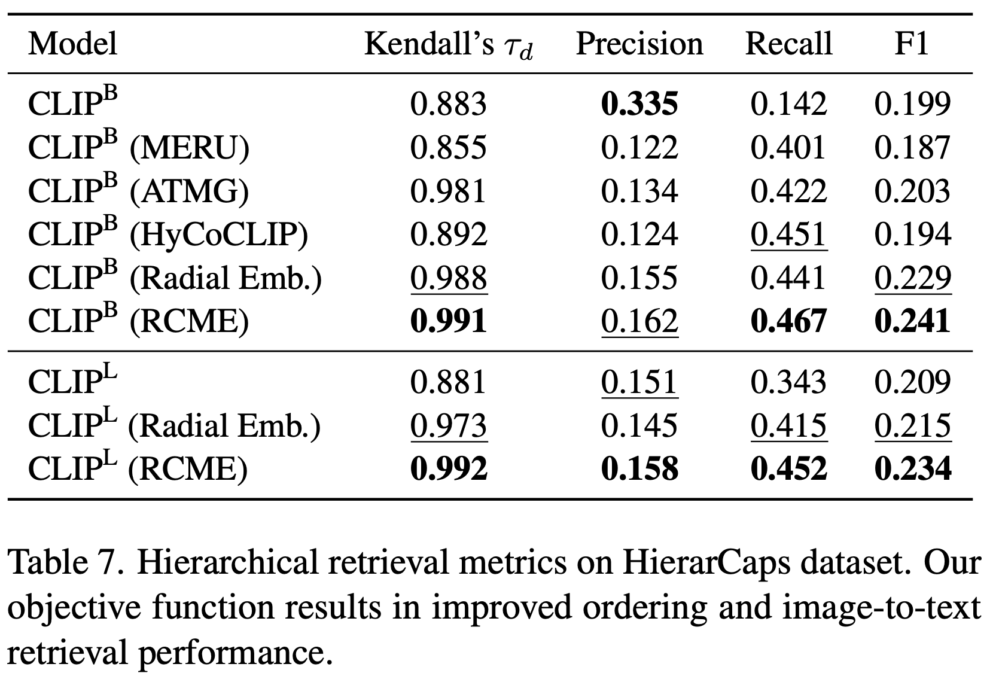

# Global and Local Entailment Learning for Natural World Imagery

<div align="center">


[](https://arxiv.org/abs/2506.21476)
[](https://vishu26.github.io/RCME/index.html)
[](https://huggingface.co/MVRL/rcme-tol-vit-base-patch16)

[Srikumar Sastry*](https://vishu26.github.io/),
[Aayush Dhakal](https://scholar.google.com/citations?user=KawjT_8AAAAJ&hl=en),
[Eric Xing](https://ericx003.github.io/),
[Subash Khanal](https://subash-khanal.github.io/),
[Nathan Jacobs](https://jacobsn.github.io/)
(*Corresponding Author)

<b>ICCV 2025</b>
</div>

<p align="center">
Radial Cross-Modal Embeddings (RCME) is a state-of-the-art hierarchical image-text ordering and retrieval method in the embedding space.
</p>

## 🔥 Textual Entailment and Ordering
<div align="center">


</div>

## ⚙️ Setup

#### Setting up 
1. Clone this repository:
```bash
git clone https://github.com/mvrl/RCME.git
```
2. Install dependencies:
```bash
cd RCME && pip install -r requirements.txt
```

## 🗂️ Data
1. Use BioCLIP's scripts to download TreeofLife-10M dataset:
```bash
rcme/data/bioclip/scripts/setup_download_tol-10m_components.bash && \
rcme/data/bioclip/scripts/submit_download_tol-10m_components.bash
```
**Hint**: Setup paths and other variables in `setup_download_tol-10m_components.bash` script.

2. Use our script to convert TreeofLife-10M dataset into iNaturalist-2021 style naming:
```bash
python rcme/data/bioclip/write_imgs.py
```
**Hint**: Setup paths and other variables in our script.

## 🔥 Training
1. Setup all hyperparameters in `rcme/config.py` file.
2. Run training by specifying the model:
```bash
python rcme/train.py --model="rcme"
```
**Hint**: Currently supports `rcme`, `radial_embeddings_model`, `atmg` and `meru`.

## ✅ Evaluation

Scripts and documentation coming soon...

📑 Citation

```bibtex
@inproceedings{sastry2025global,
    title={Global and Local Entailment Learning for Natural World Imagery},
    author={Sastry, Srikumar and Dhakal, Aayush and Xing, Eric and Khanal, Subash and Jacobs, Nathan},
    booktitle={International Conference on Computer Vision},
    year={2025},
    organization={IEEE/CVF}
}
```

## 🔍 Additional Links
Check out our lab website for other interesting works on geospatial understanding and mapping:
* Multi-Modal Vision Research Lab (MVRL) - [Link](https://mvrl.cse.wustl.edu/)
* Related Works from MVRL - [Link](https://mvrl.cse.wustl.edu/publications/)